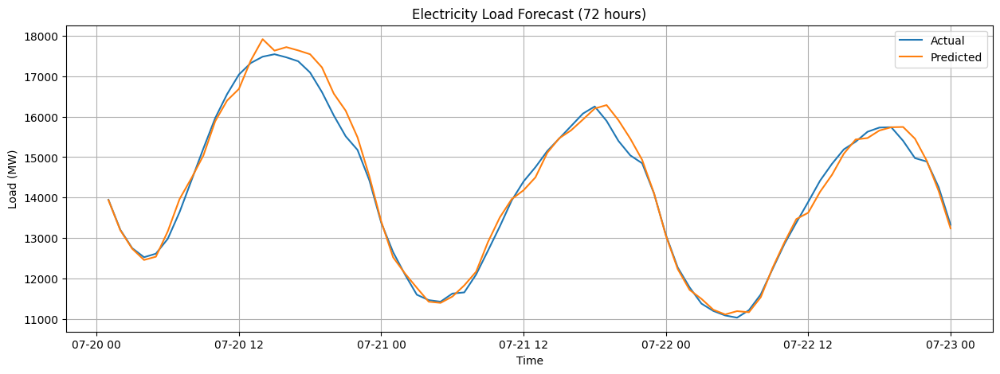

# 🚀 Electricity Demand Prediction  
_A machine learning project that analyzes historical electricity usage data to forecast future demand with improved accuracy._

---

## 📌 Overview  
This project focuses on predicting **future electricity demand** using historical consumption data and machine-learning techniques. By analyzing patterns, seasonal behavior, and long-term trends, the system generates forecasts that help stakeholders understand how electricity usage is expected to grow over time.  
Electricity demand prediction plays a crucial role in ensuring stable power supply, reducing blackouts, optimizing energy production, and supporting renewable integration. With accurate forecasts, utility providers can plan infrastructure better, reduce operational costs, and minimize energy wastage.  
The model built here serves as a practical tool for researchers, data scientists, and power companies to make informed decisions, efficiently manage resources, and build smarter, more sustainable energy systems.

---

## 🧠 Features  
- 📊 **Historical Data Analysis:** Clean and explore electricity usage patterns  
- 📈 **Visualization Tools:** Matplotlib + Seaborn graphs for trend exploration  
- 🔧 **Interactive Controls:** ipywidgets for dynamic interaction in Colab  
- 🤖 **ML-Based Forecasting:** Uses sklearn regression models to predict future electricity demand  
- 📉 **Trend & Growth Insights:** Highlights seasonal and long-term consumption patterns  
